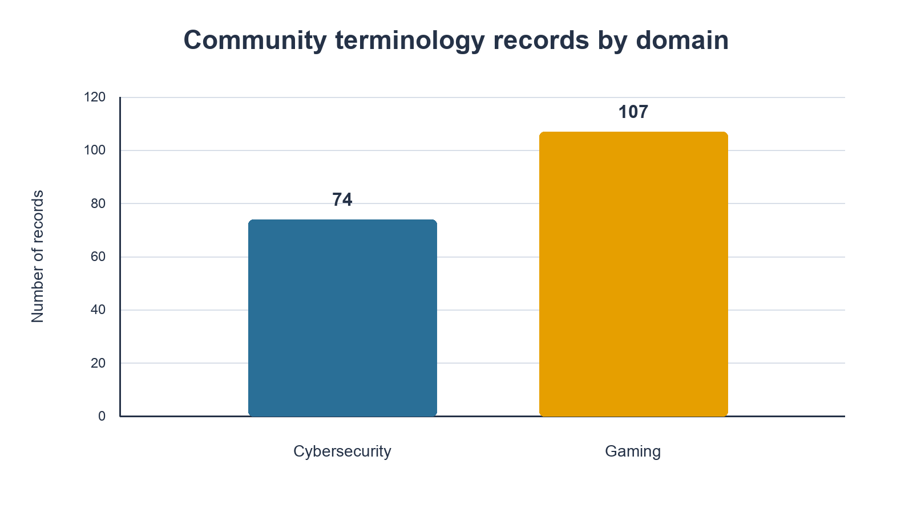
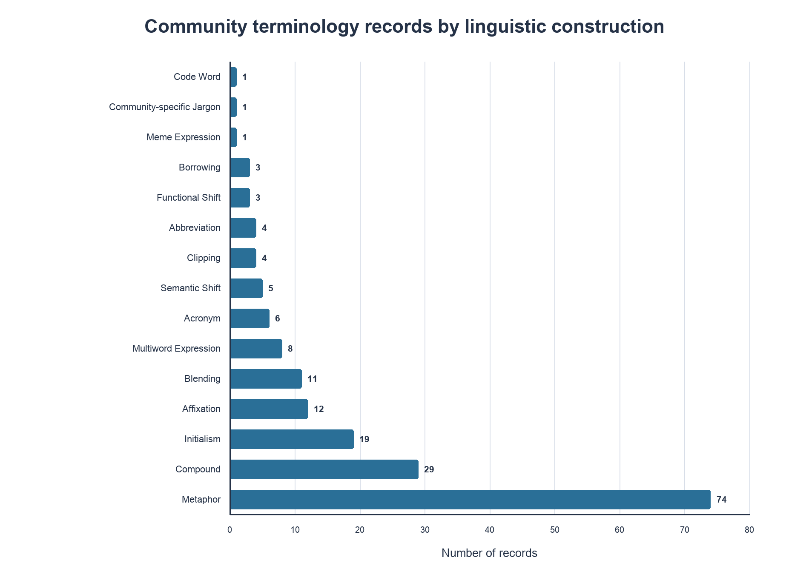

# Community Terminology for LLM Evaluation

**PURA Summer 2026 Final Research Artifact**

Guanjun Yan · Faculty mentor: Professor Wei Xu · Georgia Institute of Technology

## Project overview

This repository is the public research artifact for a Summer 2026 President's Undergraduate Research Award (PURA) project at Georgia Tech. It investigates how large language models understand opaque, lexicalized, niche, emerging, and community-specific terminology in authentic gaming and cybersecurity contexts. The central construct is **community-grounded semantic understanding**: whether a model can recover an expression's conventional meaning as used by a particular community, rather than merely recognize its component words or produce a plausible surface-level guess.

The completed artifact combines a curated terminology dataset, authentic usage examples, traceable source URLs, a structured linguistic-construction taxonomy, a collection and annotation workflow, editable and PDF guidelines, and machine-readable spreadsheet and JSON releases. It establishes a reproducible foundation for controlled model-comprehension studies. It does **not** claim that a complete large-scale LLM evaluation has already been run; the evaluation conditions and tasks described here are a proposed next stage.

Primary domains include gaming, cybersecurity, natural language processing, large language model evaluation, computational sociolinguistics, and dataset and annotation design.

## Research question

> How do large language models understand opaque, lexicalized, niche, emerging, and community-specific terminology in authentic gaming and cybersecurity contexts?

The project asks what makes terminology difficult, how authentic community context changes interpretation, and how future experiments can separate surface familiarity from genuine semantic understanding. It also treats novelty and comprehension difficulty as distinct: a new expression may be easy when its meaning is explained, while an older expression may remain opaque because it depends on technical knowledge, a game mechanic, or an insider reference.

## Why community-specific terminology matters

Online communities continually conventionalize abbreviations, technical expressions, metaphors, memes, and shifted meanings. These forms can evolve faster than model-training cycles and can remain difficult even when every individual word is familiar. For example, interpreting a phrase such as *golden ticket* in a security discussion or *blueberries* in Destiny requires the reader to connect the expression to a community-specific sense.

This makes community terminology a useful test bed for lexical-semantic evaluation, context ablation, retrieval, uncertainty calibration, and model self-correction. It also exposes a methodological problem: a sentence that directly defines the term may test copying rather than understanding. The artifact therefore preserves authentic usage evidence and explicitly documents the need to screen future benchmark items for definition leakage.

## Artifact contents

- [Spreadsheet research release](data/source/refined_terminology_usage.xlsx) with `Cybersecurity`, `Gaming`, and `Source Audit` sheets.
- [Machine-readable JSON release](data/release/community_terminology_dataset.json) with release metadata and 181 records.
- [PDF annotation guideline](documentation/annotation_guideline.pdf) and [editable DOCX guideline](documentation/annotation_guideline.docx).
- [PURA final report](documentation/pura_final_report.pdf) and its [editable DOCX source](documentation/pura_final_report.docx).
- [Dataset card](docs/dataset_card.md), [methodology](docs/methodology.md), [annotation schema](docs/annotation_schema.md), and [limitations and ethics](docs/limitations_and_ethics.md).
- [Proposed future experiments](docs/future_experiments.md), framed separately from completed work.
- Reproducible summary generation, charts, checksums, and a [validation report](validation/validation_report.md).
- Archived originals in `archive/original_files/`; publication copies are byte-identical except for the JSON release-version normalization documented in the [file manifest](docs/file_manifest.md).

## Dataset at a glance

All figures below were recomputed independently from both the workbook and JSON release. The formats agree exactly across every record.

| Domain | Records |
|---|---:|
| Cybersecurity | 74 |
| Gaming | 107 |
| Total | 181 |





The release has no missing values in its seven required record fields, no duplicate IDs, and no exact duplicate terms. One URL is shared by two distinct cybersecurity records, `MFA fatigue` and `MFA bombing`; it is retained and documented because one discussion page supports both expressions. See the [dataset card](docs/dataset_card.md) for complete construction and source-family distributions.

## Dataset schema

Each entry in the JSON `records` array contains:

| Field | Description |
|---|---|
| `id` | Stable release identifier, such as `cybersecurity_001`. |
| `domain` | Top-level domain: `cybersecurity` or `gaming`. |
| `term` | Narrowest complete community-specific expression. |
| `linguistic_construction` | One label from the controlled 15-category taxonomy. |
| `community_subcommunity` | Broad community followed by the narrower context. |
| `real_usage_example` | Authentic usage sentence retained as evidence, not rewritten as a definition. |
| `source_url` | Direct page or thread URL associated with the usage example. |

The workbook uses equivalent human-readable columns: `Term`, `Linguistic Construction`, `Community / Sub-community`, `Real Usage Example`, and `Source Link`.

## Collection and annotation workflow

The documented workflow is evidence-centered:

1. Collect relevant source communities, including forums, subreddits, technical boards, wikis, documentation, and specialist discussion sites.
2. Read authentic threads and discussions rather than beginning from decontextualized keyword lists.
3. Identify expressions that are opaque, shifted, abbreviated, coded, or conventionalized in the target community.
4. Save the full authentic usage sentence immediately and select the narrowest complete term span.
5. Verify the expression using community-sensitive search and surrounding discussion.
6. Use translation checks when relevant and an LLM interpretation check as diagnostic evidence, never as gold evidence.
7. Keep, exclude, or review a candidate based on authentic community support and a stable context-specific sense.
8. Annotate domain, construction, community/subcommunity, usage evidence, and source URL.

Community evidence outranks surface intuition. Real usage should not directly define the target expression, source links should resolve to retrievable pages, and AI-generated text is not an authentic usage example. Search-result counts are unstable retrieval metadata rather than popularity estimates. Translation tools and LLMs are aids for identifying ambiguity or likely failure, not authoritative sources.

## Linguistic-construction taxonomy

The controlled vocabulary has 15 descriptive labels: **Abbreviation, Acronym, Affixation, Blending, Borrowing, Clipping, Code Word, Community-specific Jargon, Compound, Functional Shift, Initialism, Meme Expression, Metaphor, Multiword Expression,** and **Semantic Shift**. All 15 are observed in the release.

The label records how an expression is formed or conventionalized, not how difficult it is for a model or reader. Where two constructions appear plausible, the guideline recommends selecting the best primary label and flagging the case for review. Definitions, decision rules, and dataset examples are available in the [annotation schema](docs/annotation_schema.md).

## Repository structure

```text
.
├── data/              # Spreadsheet source release and JSON release
├── documentation/     # Annotation guideline and PURA report
├── docs/              # Dataset card, methodology, schema, ethics, and experiments
├── assets/            # Data-derived distribution charts
├── scripts/           # Summary generation and artifact validation
├── validation/        # Summary, report, and SHA-256 checksums
├── archive/           # Byte-identical copies of supplied originals
└── .github/workflows/ # Continuous validation
```

The [file manifest](docs/file_manifest.md) describes the role, provenance, and naming of each publication file.

## Using the dataset

The JSON release is a metadata object whose `records` member contains the observations. A compact record looks like this:

```json
{
  "id": "gaming_001",
  "domain": "gaming",
  "term": "freeze the wave",
  "linguistic_construction": "Metaphor",
  "community_subcommunity": "League of Legends / Top-Lane Wave Management",
  "real_usage_example": "Everyone always says \"freeze the wave\" ...",
  "source_url": "https://www.reddit.com/r/summonerschool/..."
}
```

Minimal Python loading example:

```python
import json
from pathlib import Path

payload = json.loads(
    Path("data/release/community_terminology_dataset.json").read_text(encoding="utf-8")
)
records = payload["records"]
gaming_terms = [row for row in records if row["domain"] == "gaming"]
print(len(gaming_terms))  # 107 in release 1.0.0
```

Researchers should preserve the record IDs and source URLs when deriving subsets. If the authentic quotations are redistributed in another artifact, review the relevant platform terms and quotation context rather than assuming the repository's permissions extend to third-party text.

## Validating the release

Use Python 3.10 or newer. Install the small validation dependency set, regenerate summaries if needed, and run the validator:

```bash
python -m pip install -r requirements.txt
python scripts/generate_summary.py --check
python scripts/validate_artifact.py
```

The validator checks required files, archived/publication identity or documented record-level equivalence, release metadata, workbook sheets and headers, JSON fields and IDs, domain and construction counts, controlled labels, workbook-to-JSON equality, README links, URL syntax, PDF page/text presence, chart dimensions, README structure, and recorded checksums. It does not require live network access because online community pages can be volatile or rate-limited.

## Completed project outcomes

The completed project produced a curated terminology dataset; authentic usage examples with traceable source URLs; a structured construction taxonomy; a collection and annotation workflow; annotation guidelines; a spreadsheet research release; a machine-readable JSON release; and a research foundation for controlled LLM-comprehension experiments. The earlier work also included a cybersecurity annotation pilot and preparation of data for a Thresh-compatible annotation workflow, as described in the final report.

These outcomes concern artifact construction and research design. No benchmark leaderboard, model ranking, or large-scale evaluation score is reported in this release.

## Proposed future experiments

The proposed next stage compares progressively richer conditions: term only, term plus sentence, term plus paragraph, term plus community metadata, and term plus external retrieval. Candidate tasks include definition generation, multiple-choice meaning selection, cloze completion, contrastive usage discrimination, paraphrasing, uncertainty reporting, token-probability or perplexity analysis, retrieval query generation, evidence selection, and agentic self-correction.

Recommended metrics include accuracy, semantic similarity, rubric-based human scoring, pairwise preference, calibration, perplexity differences, context improvement, retrieval precision, evidence attribution, and error-type frequency. These are recommendations, not completed results. The full proposal, including leakage-aware split design, appears in [future experiments](docs/future_experiments.md).

## Limitations and ethical considerations

The dataset is curated rather than statistically representative. Gaming and cybersecurity are unevenly distributed, construction categories are highly imbalanced, source platforms and genres differ, and community meanings change over time. A linked page shows authentic usage but does not prove that the term originated there or quantify popularity. Some examples may still contain direct-definition leakage or unresolved ambiguity, and additional human validation is needed; no inter-annotator reliability statistic is claimed.

The artifact preserves public source links and short usage excerpts for research traceability, but posts may be edited or deleted. Public availability does not eliminate privacy considerations or automatically grant redistribution rights under a repository-wide license. Cybersecurity terms are included to study language, not to teach operational misuse. See [limitations and ethics](docs/limitations_and_ethics.md) and [license notes](LICENSE_NOTES.md).

## Citation

Please cite the artifact metadata in [CITATION.cff](CITATION.cff). A plain-text form is:

> Yan, Guanjun. (2026). *Community Terminology for LLM Evaluation: PURA Summer 2026 Final Research Artifact* (Version 1.0.0). Georgia Institute of Technology.

## Acknowledgements

Guanjun Yan thanks Professor Wei Xu for faculty mentorship; Geyang Guo, Jonathan Zheng, Professor Alan Ritter, and other research-group members for feedback and support; and the Georgia Tech President's Undergraduate Research Award program for funding the Summer 2026 research experience.
