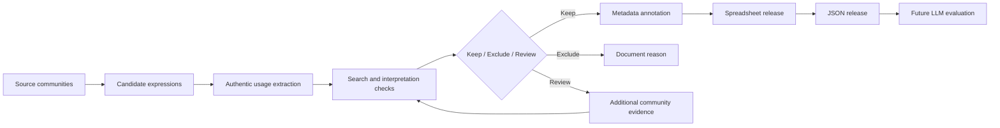

# Methodology

## Project evolution

The project began with an interest in English and Chinese neologisms. Early literature review considered neologism benchmarks, semantic change, Chinese internet language, automated term detection, and specialized readability. This stage highlighted different mechanisms - including homophones, character substitution, code-switching, compounding, abbreviation, and semantic shift - but also showed that word formation alone could not explain comprehension difficulty.

The research question subsequently narrowed from novelty in general to community-grounded meaning. A reader or model can recognize every surface word and still miss the conventional meaning used by a gaming or cybersecurity community. The final released dataset therefore focuses on English terminology in gaming and cybersecurity, while the earlier bilingual motivation remains part of the project's intellectual history.

## Cybersecurity annotation pilot

The final report describes an initial cybersecurity pilot built from authentic Reddit discussions. Direct collection through ordinary Python and terminal requests was blocked, so snapshot JSON pages were retrieved and comment fields were isolated. The first pilot contained 193 comment entries and 40 annotation hits across four batches. Labels were tested manually in a spreadsheet before conversion to a Thresh-compatible format.

The work later expanded to 12 annotation files averaging approximately 20 hits each. These pilot and annotation-infrastructure outcomes informed the broader artifact, but the present repository is primarily the final terminology dataset and documentation release; it does not claim to package or rerun every historical pilot component.

## Broader terminology collection

The broader collection drew on gaming forums, public community discussions, technical boards, wikis, documentation, industry research, institutional reports, and related sources. The collector read threads, identified terminology that appeared niche, coded, conventionalized, shifted, or difficult to interpret outside the community, and saved the authentic usage sentence.

Candidates were verified using local context and community-sensitive search. Google Translate was used when translation was relevant, and Gemini was used as an interpretation check. These systems served as diagnostic aids: their output could reveal ambiguity or likely model failure, but it did not establish the gold meaning. General expressions without a stable community-specific sense were excluded.

For each retained item, the release records a term, one primary linguistic-construction label, a community/subcommunity description, an authentic usage example, and a source URL. The spreadsheet was then converted into a structured JSON artifact with stable record IDs and release-level metadata.

## Workflow

## Annotation principles

The workflow follows several principles from the supplied guideline:

1. Annotate an expression in its cited context rather than from surface form alone.
2. Select the narrowest complete term span and preserve spelling, capitalization, punctuation, and numerals.
3. Prefer authentic community evidence to intuition or a generic dictionary sense.
4. Preserve a complete, natural usage sentence that does not simply define the term.
5. Save a direct, retrievable page or thread URL rather than a search-results page.
6. Do not use AI-generated or paraphrased text as the authentic usage example.
7. Treat search counts as unstable retrieval metadata, not popularity measures.
8. Treat translation systems and LLMs as verification aids, not authoritative sources.
9. Separate novelty from comprehension difficulty.

## Artifact preparation and validation

The final spreadsheet contains `Cybersecurity`, `Gaming`, and `Source Audit` sheets. The two domain sheets have the same five core columns and contain 74 and 107 records, respectively. The JSON release wraps 181 records in a metadata object and assigns stable sequential IDs.

Repository curation preserved byte-identical originals, normalized publication filenames and the JSON release-version metadata, recomputed all summary statistics from the record-level data, compared the workbook and JSON field by field, validated the 15-label controlled vocabulary, generated data-derived charts, and converted the PURA report to a visually verified three-page PDF. No record-level disagreements requiring a derived correction were found.

## Relationship to future evaluation

The completed methodology ends with a validated research artifact. Controlled LLM experiments remain future work. Proposed conditions vary the information available to a model - from the term alone through sentence, paragraph, community metadata, and external retrieval - so that context improvement and retrieval behavior can be measured explicitly.
